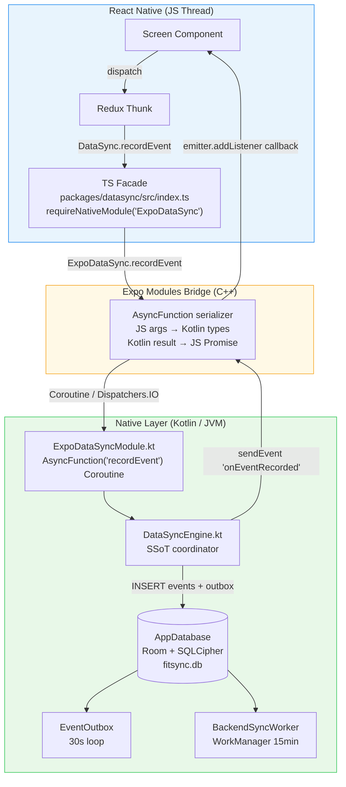
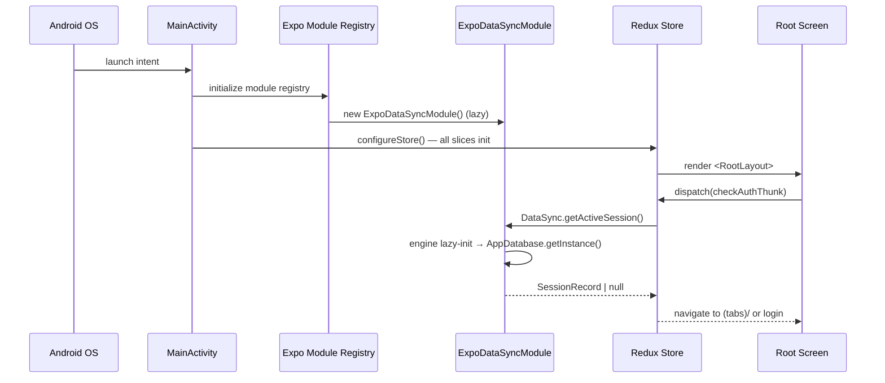

# 03 — DataSync Module

The `@fitsync/datasync` package is the heart of the application. It wraps an SQLCipher-encrypted Room database and exposes its functionality to React Native via the Expo Modules API.

---

## Package Structure

```
packages/datasync/
├── src/
│   └── index.ts                    # JS bridge + TypeScript types
└── android/src/main/java/expo/modules/datasync/
    ├── ExpoDataSyncModule.kt        # Expo Module definition
    ├── db/
    │   ├── AppDatabase.kt           # Room database (SQLCipher)
    │   ├── KeystoreHelper.kt        # Android Keystore passphrase
    │   ├── dao/                     # Room DAOs
    │   └── entities/                # Room entities
    ├── engine/
    │   ├── DataSyncEngine.kt        # Core data operations
    │   ├── EventOutbox.kt           # Reliable delivery state machine
    │   └── BackendSyncManager.kt   # HTTP batch upload
    ├── nearby/
    │   ├── NearbyManager.kt         # Google Nearby Connections
    │   └── NearbyPayloadHandler.kt  # Payload serialization
    └── worker/
        ├── BackendSyncWorker.kt    # WorkManager worker for backend HTTP sync
        ├── DeviceSyncWorker.kt     # WorkManager worker for device-to-device sync
        └── SyncScheduler.kt        # WorkManager scheduling
```

---

## Room Database Setup

### Database Class (`AppDatabase.kt`)

```kotlin
@Database(
    entities = [
        MemberEntity::class, PaymentEntity::class, WeightRecordEntity::class,
        AwardEntity::class, SessionEntity::class, TodoEntity::class,
        DeviceEntity::class, EventEntity::class, OutboxEntity::class
    ],
    version = 1,
    exportSchema = false
)
abstract class AppDatabase : RoomDatabase() {
    abstract fun memberDao(): MemberDao
    abstract fun eventDao(): EventDao
    abstract fun outboxDao(): OutboxDao
    // ... other DAOs
}
```

### SQLCipher Integration

Room uses a custom `SupportFactory` to open the database with a per-device passphrase:

```kotlin
val passphrase = KeystoreHelper.getOrCreatePassphrase(context)
val factory = SupportFactory(passphrase)

Room.databaseBuilder(context, AppDatabase::class.java, "fitsync.db")
    .openHelperFactory(factory)
    .fallbackToDestructiveMigration()
    .build()
```

The database file `fitsync.db` is AES-256 encrypted at rest. Without the passphrase, the file is unreadable.

---

## Android Keystore Passphrase Management

`KeystoreHelper.kt` manages the encryption passphrase securely:

```kotlin
object KeystoreHelper {
    fun getOrCreatePassphrase(context: Context): ByteArray {
        // 1. Open EncryptedSharedPreferences (backed by Android Keystore AES-256-GCM)
        val masterKey = MasterKey.Builder(context)
            .setKeyScheme(MasterKey.KeyScheme.AES256_GCM)
            .build()
        val prefs = EncryptedSharedPreferences.create(context, "fitsync_secure_prefs", masterKey, ...)

        // 2. Return existing passphrase or generate a new 32-byte random one
        val existing = prefs.getString("db_passphrase", null)
        if (existing != null) return Base64.decode(existing, Base64.NO_WRAP)

        val passphrase = ByteArray(32)
        SecureRandom().nextBytes(passphrase)
        prefs.edit().putString("db_passphrase", Base64.encodeToString(passphrase, ...)).apply()
        return passphrase
    }
}
```

**Key properties:**

- Passphrase generated once per device, stored encrypted
- Backed by the Android Keystore hardware security module
- Never leaves device memory in plaintext

---

## KSP Annotation Processing

Room uses Kotlin Symbol Processing (KSP) to generate DAO implementations at compile time. This is configured via `withKspPlugin.js` and the app-level `build.gradle`:

```groovy
// android/build.gradle (injected by withKspPlugin)
classpath('com.google.devtools.ksp:com.google.devtools.ksp.gradle.plugin:2.1.20-2.0.1')
classpath('org.jetbrains.kotlin:kotlin-serialization:2.1.20')

// packages/datasync/android/build.gradle
plugins {
    id 'com.google.devtools.ksp'
}
dependencies {
    ksp("androidx.room:room-compiler:2.7.1")
}
```

KSP processes `@Entity`, `@Dao`, `@Database` annotations and generates the implementation classes. Generated code lives in `build/generated/ksp/`.

---

## Room Entity Definitions

### `EventEntity`

```kotlin
@Entity(tableName = "events")
data class EventEntity(
    @PrimaryKey @ColumnInfo(name = "event_id") val eventId: String,
    @ColumnInfo(name = "device_id")            val deviceId: String,
    @ColumnInfo(name = "session_id")           val sessionId: String,
    @ColumnInfo(name = "event_type")           val eventType: String,
    @ColumnInfo(name = "occurred_at")          val occurredAt: Long,        // epoch ms
    val payload: String,                                                      // JSON string
    @ColumnInfo(name = "idempotency_key")      val idempotencyKey: String,
    @ColumnInfo(name = "correlation_id")       val correlationId: String,
    @ColumnInfo(name = "created_at")           val createdAt: Long = System.currentTimeMillis()
)
```

### `OutboxEntity`

```kotlin
@Entity(
    tableName = "outbox",
    foreignKeys = [ForeignKey(
        entity = EventEntity::class,
        parentColumns = ["event_id"],
        childColumns  = ["event_id"],
        onDelete = ForeignKey.CASCADE
    )],
    indices = [Index("event_id", unique = true), Index("status")]
)
data class OutboxEntity(
    @PrimaryKey(autoGenerate = true) val id: Long = 0,
    @ColumnInfo(name = "event_id")   val eventId: String,
    val status: String = "Pending",  // Pending | DeviceSynced | BackendSynced | Failed
    @ColumnInfo(name = "retry_count")     val retryCount: Int = 0,
    @ColumnInfo(name = "last_attempt_at") val lastAttemptAt: Long? = null,
    @ColumnInfo(name = "error_message")   val errorMessage: String? = null,
    @ColumnInfo(name = "created_at")      val createdAt: Long = System.currentTimeMillis()
)
```

---

## DAO Patterns

```kotlin
@Dao
interface EventDao {
    @Insert(onConflict = OnConflictStrategy.IGNORE) // idempotent
    suspend fun insertEvent(event: EventEntity): Long

    @Query("SELECT * FROM events WHERE session_id = :sessionId ORDER BY occurred_at ASC")
    suspend fun getEventsBySession(sessionId: String): List<EventEntity>

    @Query("SELECT * FROM events WHERE idempotency_key = :key LIMIT 1")
    suspend fun findByIdempotencyKey(key: String): EventEntity?
}

@Dao
interface OutboxDao {
    @Query("SELECT * FROM outbox WHERE status = 'Pending' ORDER BY created_at ASC LIMIT :limit")
    suspend fun getPendingEntries(limit: Int = 50): List<OutboxEntity>

    @Query("UPDATE outbox SET status = :status WHERE event_id = :eventId")
    suspend fun updateStatus(eventId: String, status: String)
}
```

---

## Expo Modules API Bridge Pattern

### Module Definition (`ExpoDataSyncModule.kt`)

```kotlin
class ExpoDataSyncModule : Module() {
    override fun definition() = ModuleDefinition {
        Name("ExpoDataSync")

        // Expose events to JS
        Events("onEventRecorded", "onSyncStatusChanged", "onDeviceFound", "onDeviceConnectionChanged")

        // AsyncFunction — runs in a coroutine, returns result to JS Promise
        AsyncFunction("recordEvent") Coroutine { eventType: String, payloadJson: String ->
            val event = engine.recordEvent(eventType, payloadJson)
            eventOutbox.enqueue(event.eventId)
            mapOf("eventId" to event.eventId, "occurredAt" to event.occurredAt)
        }

        AsyncFunction("getMembers") Coroutine { sessionId: String ->
            engine.getMembers(sessionId).map { it.toMap() }
        }

        AsyncFunction("startNearbyAdvertising") Coroutine { deviceName: String ->
            nearbyManager.startAdvertising(deviceName)
        }
    }
}
```

### JS Bridge (`packages/datasync/src/index.ts`)

```typescript
import { requireNativeModule, type EventSubscription } from 'expo-modules-core';

const ExpoDataSync = requireNativeModule('ExpoDataSync');

export async function recordEvent(
  eventType: string,
  payload: Record<string, unknown>,
): Promise<{ eventId: string; occurredAt: number }> {
  return ExpoDataSync.recordEvent(eventType, JSON.stringify(payload));
}

export function addSyncStatusListener(
  listener: (event: SyncStatusEvent) => void,
): EventSubscription {
  return ExpoDataSync.addListener('onSyncStatusChanged', listener);
}
```

All `AsyncFunction` calls return a JS `Promise`. The `Coroutine` lambda runs on `Dispatchers.IO` (the module's coroutine scope). Returning a `Map<String, Any>` automatically bridges to a JS object.

---

## How JS Talks to Kotlin — The Bridge Explained

> _"How does `DataSync.recordEvent(...)` called in TypeScript end up running Kotlin code that writes to a Room database?"_

### Bird's-eye view



---

### Build-time wiring: 5 files that connect everything

```
apps/mobile/package.json
  └─ "@fitsync/datasync": "workspace:*"  → pnpm symlinks the local package

packages/datasync/expo-module.config.json
  └─ "modules": ["expo.modules.datasync.ExpoDataSyncModule"]
       → expo prebuild generates ExpoModulesPackageList.java
       → Kotlin class is registered automatically (no manual AndroidManifest edits)

apps/mobile/plugins/withKspPlugin.js
  └─ runs during expo prebuild
       → injects KSP classpath into android/build.gradle
       → without it, Room @Dao/@Entity annotations cannot be processed

packages/datasync/android/...ExpoDataSyncModule.kt
  └─ the Kotlin class that defines every callable JS function

packages/datasync/src/index.ts
  └─ the TypeScript facade that wraps each Kotlin AsyncFunction
```

---

### What happens during `expo prebuild`

```
npx expo prebuild --platform android
│
├─ Reads app.json → runs config plugins
│   └─ withKspPlugin.js → injects KSP classpath into android/build.gradle
│
├─ Scans node_modules/**/expo-module.config.json
│   └─ finds @fitsync/datasync → registers ExpoDataSyncModule
│
├─ Generates android/app/src/.../ExpoModulesPackageList.java
├─ Generates android/settings.gradle   include ':datasync'
└─ Generates android/gradle.properties  reactNativeArchitectures=arm64-v8a
```

---

### Runtime boot sequence



---

### Complete call trace: `dispatch(createTodoThunk)`

```
1. [Screen]        user presses "Add" → dispatch(createTodoThunk({ title, sessionId }))

2. [Redux Thunk]   await DataSync.recordEvent('TodoCreated', { todoId, title }, sessionId)

3. [TS Facade]     ExpoDataSync.recordEvent('TodoCreated', '{"todoId":"..."}', sessionId)
                   ↓  crosses the JS bridge

4. [JS Bridge]     serializes 3 string args → invokes Kotlin Coroutine on Dispatchers.IO

5. [Kotlin]        engine.recordEvent(eventType, payload, deviceId, sessionId)

6. [DataSyncEngine]
                   db.eventDao().insert(EventEntity(...))
                   db.outboxDao().insert(OutboxEntity(status = "Pending"))
                   applyEventSideEffects(...)  // updates todos table
                   return eventId

7. [Kotlin → JS]   sendEvent("onEventRecorded", mapOf("eventId" to eventId, ...))
                   return eventId  → resolves the JS Promise

8. [Redux Thunk]   .fulfilled fires → dispatch(loadTodosThunk())
                   → DataSync.getAllTodos() → Kotlin reads Room → JS array

9. [Screen]        useAppSelector(selectTodos) re-renders
```

---

### ExpoDataSyncModule.kt — annotated reference

```kotlin
class ExpoDataSyncModule : Module() {

    // Lazy-init: Room database not opened until first AsyncFunction call
    private val engine: DataSyncEngine by lazy {
        DataSyncEngine(appContext.reactContext!!)
    }

    override fun definition() = ModuleDefinition {

        // Must match requireNativeModule('ExpoDataSync') in index.ts
        Name("ExpoDataSync")

        // All events the module can emit to JS listeners
        Events("onEventRecorded", "onSyncStatusChanged", "onDeviceFound")

        // Coroutine infix is REQUIRED when calling any suspend function
        AsyncFunction("recordEvent") Coroutine { eventType: String, payload: String, sessionId: String ->
            val eventId = engine.recordEvent(eventType, payload, getDeviceId(), sessionId)
            sendEvent("onEventRecorded", mapOf("eventId" to eventId, "eventType" to eventType))
            eventId   // becomes the resolved Promise value in JS
        }

        AsyncFunction("getAllTodos") Coroutine { ->
            engine.getAllTodos().map { it.toMap() }
        }

        // Functions that don't call suspend code don't need Coroutine
        AsyncFunction("schedulePeriodicSync") {
            SyncScheduler.schedulePeriodicBackendSync(appContext.reactContext!!)
            "ok"
        }
    }
}
```

---

### The Outbox state machine

```
Pending outbox entries are drained by two background processes:

EventOutbox.kt (30-second polling loop)
  1. SELECT * FROM outbox WHERE status = 'Pending' LIMIT 50
  2. Serialize events to JSON batch
  3. NearbyManager.sendPayload(endpointId, batch)   ← Bluetooth/WiFi Direct
  4. On ACK: UPDATE outbox SET status = 'DeviceSynced'
  5. sendEvent("onSyncStatusChanged")  → JS UI updates

BackendSyncWorker.kt (WorkManager, 15-min periodic job)
  1. SELECT * FROM outbox WHERE status = 'DeviceSynced' LIMIT 100
  2. HTTP POST /api/events  (batch upload)
  3. On 200 OK: UPDATE outbox SET status = 'BackendSynced'
  4. WorkManager handles retry with exponential backoff on failure
```
