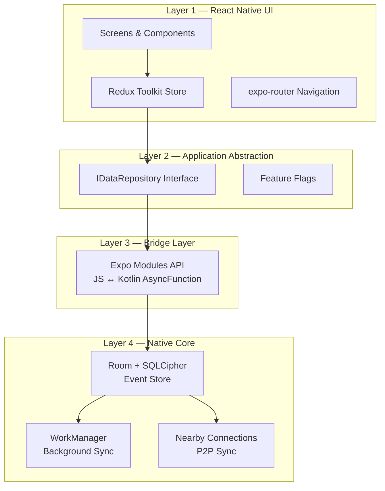
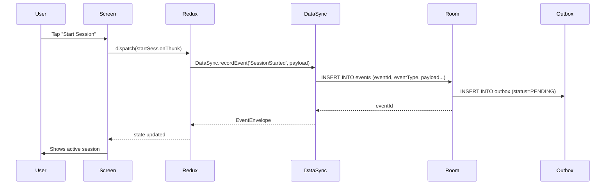
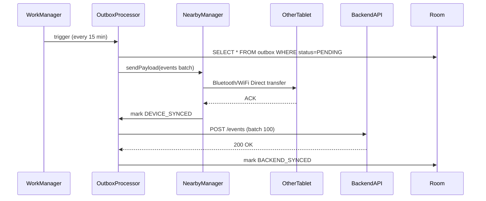
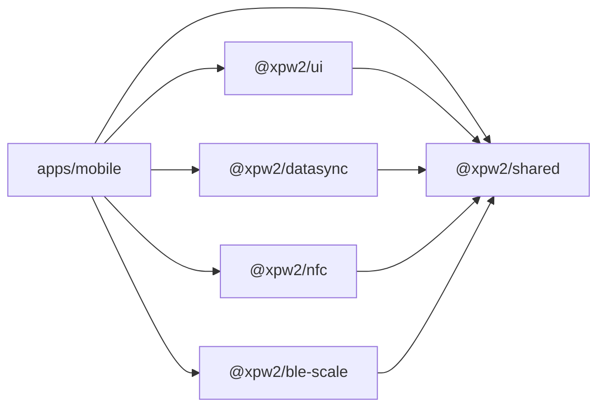
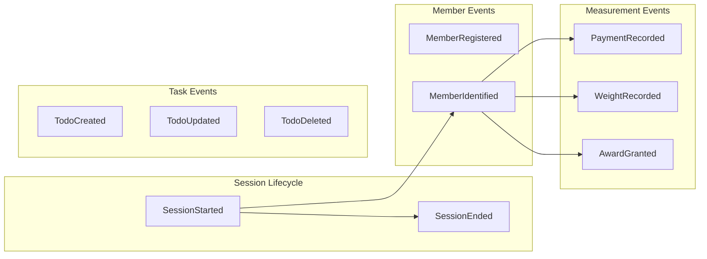
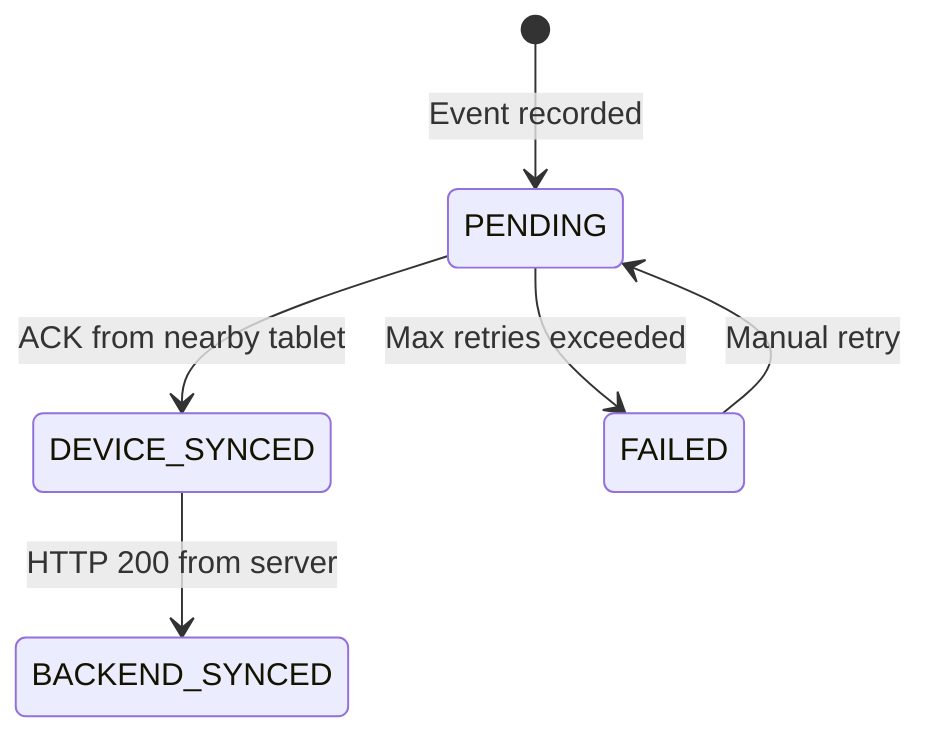
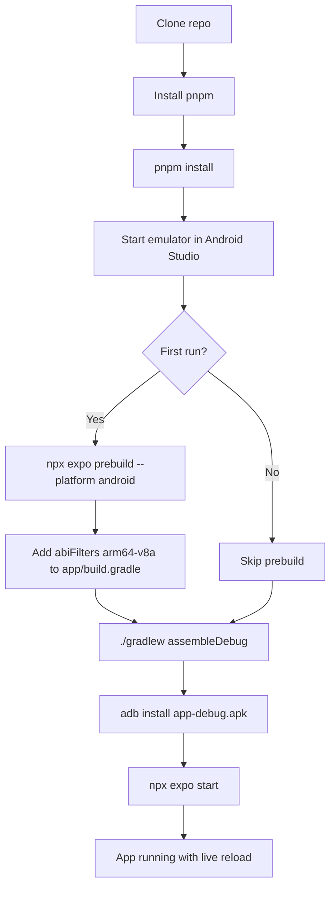
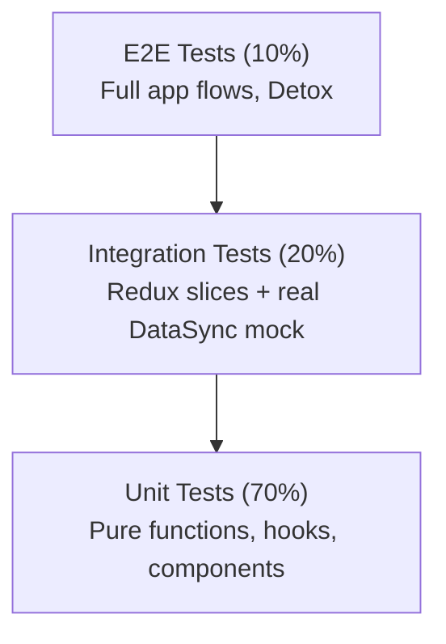
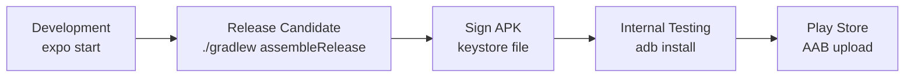
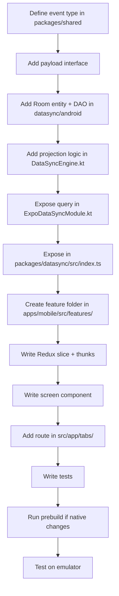

# Building an Offline-First Event-Driven React Native App from Scratch

> A complete guide for newbies to build a production-grade, offline-first Android body management app using Expo, TypeScript, Redux Toolkit, and a native Kotlin DataSync engine.

---

## Table of Contents

1. [What You Are Building](#1-what-you-are-building)
2. [Prerequisites](#2-prerequisites)
3. [Architecture Overview](#3-architecture-overview)
4. [Repository & Monorepo Setup](#4-repository--monorepo-setup)
5. [Project Structure Deep Dive](#5-project-structure-deep-dive)
6. [Event Model — The Heart of Everything](#6-event-model--the-heart-of-everything)
7. [Package-by-Package Walkthrough](#7-package-by-package-walkthrough)
8. [Building the Mobile App Feature-by-Feature](#8-building-the-mobile-app-feature-by-feature)
9. [Running Locally](#9-running-locally)
10. [Testing](#10-testing)
11. [Building for Release](#11-building-for-release)
12. [Continuing Development](#12-continuing-development)
13. [Common Pitfalls & Fixes](#13-common-pitfalls--fixes)

---

## 1. What You Are Building

**XPW2** is an offline-first, event-driven Android tablet app for body management sessions. Think of it as:

- A **gym/event manager** that works without internet
- Multiple **tablets sync data directly** between each other over Bluetooth/Wi-Fi Direct
- All data is **immutable event log** stored in an encrypted SQLite database (Room + SQLCipher)
- NFC cards identify members, BLE scales record weights

### Core capabilities

| Feature | What it does |
|---|---|
| Session management | Start/end work sessions, track events |
| Member identification | Scan NFC cards to identify members |
| Weight recording | Connect BLE scales wirelessly, record readings |
| Cross-device sync | Sync events peer-to-peer via Nearby Connections |
| Backend sync | Upload events to server when online (outbox pattern) |
| Todo management | Create/update/delete tasks, synced across devices |

---

## 2. Prerequisites

### Tools to install first

```bash
# Node.js (v20+)
nvm install 20 && nvm use 20
node --version     # v22.x or later

# pnpm package manager
npm install -g pnpm@10.20.0
pnpm --version

# Expo CLI
npm install -g expo-cli

# Android development
# Install Android Studio: https://developer.android.com/studio
# Set environment variables in ~/.zshrc or ~/.bashrc:
export ANDROID_HOME=$HOME/Library/Android/sdk
export PATH=$PATH:$ANDROID_HOME/emulator
export PATH=$PATH:$ANDROID_HOME/platform-tools

# Java 17 (required for Gradle)
# Install Zulu JDK 17: https://www.azul.com/downloads/
export JAVA_HOME=/Library/Java/JavaVirtualMachines/zulu-17.jdk/Contents/Home
```

### Verify setup

```bash
node --version        # v20+
pnpm --version        # 10.x
java -version         # openjdk 17
adb devices           # lists connected emulators/devices
```

### Create a virtual device

1. Open Android Studio → **Device Manager** → **Create Device**
2. Choose **Pixel 7** (or similar) → **API 35** (Android 15)
3. Select **arm64-v8a** (Apple Silicon) or **x86_64** (Intel Mac / Windows)
4. Start the emulator — you'll see `emulator-5554` in `adb devices`

---

## 3. Architecture Overview

The project uses a **4-layer architecture** with a native DataSync engine at the core.



### Data flow — write path



### Data flow — sync path



---

## 4. Repository & Monorepo Setup

### Step 1 — Create the monorepo root

```bash
mkdir my-offline-app && cd my-offline-app
git init
```

Create `pnpm-workspace.yaml`:

```yaml
packages:
  - "apps/*"
  - "packages/*"
```

Create root `package.json`:

```json
{
  "name": "my-app-monorepo",
  "version": "0.0.1",
  "private": true,
  "scripts": {
    "dev": "pnpm --filter mobile expo start",
    "android": "pnpm --filter mobile expo run:android",
    "build": "turbo run build",
    "test": "turbo run test",
    "lint": "turbo run lint"
  },
  "devDependencies": {
    "turbo": "^2.5.0",
    "typescript": "~5.8.3",
    "prettier": "^3.5.0"
  },
  "resolutions": {
    "react": "19.2.0",
    "react-native": "0.83.4"
  },
  "packageManager": "pnpm@10.20.0",
  "engines": { "node": ">=20.0.0" }
}
```

Create `turbo.json`:

```json
{
  "$schema": "https://turbo.build/schema.json",
  "tasks": {
    "build": { "dependsOn": ["^build"], "outputs": ["dist/**"] },
    "test": { "dependsOn": ["^build"] },
    "lint": {},
    "clean": { "cache": false }
  }
}
```

### Step 2 — Create the Expo mobile app

```bash
mkdir -p apps/mobile
cd apps/mobile
npx create-expo-app@latest . --template blank-typescript
```

### Step 3 — Create shared packages

```bash
# Create each package directory
mkdir -p packages/{shared,ui,datasync,nfc,ble-scale,tsconfig}

# Each package needs a package.json, tsconfig.json, and src/index.ts
```

### Step 4 — Install everything

```bash
cd ../..   # back to monorepo root
pnpm install
```

### Workspace dependency diagram



---

## 5. Project Structure Deep Dive

### Complete directory tree

```
my-offline-app/
├── apps/
│   └── mobile/                         # The Expo Android app
│       ├── app.json                    # Expo config (package name, permissions, plugins)
│       ├── package.json                # App dependencies
│       ├── jest.config.js              # Jest setup
│       ├── plugins/
│       │   └── withKspPlugin.js        # Custom Gradle plugin (KSP, arm64)
│       ├── android/                    # Generated by expo prebuild (DO NOT EDIT)
│       └── src/
│           ├── app/                    # expo-router routes (file = route)
│           │   ├── _layout.tsx         # Root layout: Redux Provider, auth gate
│           │   ├── login.tsx           # Login route
│           │   └── (tabs)/             # Tab group
│           │       ├── _layout.tsx     # Tab bar config
│           │       ├── index.tsx       # → SessionScreen
│           │       ├── members.tsx     # → MemberIdentifyScreen
│           │       ├── weigh.tsx       # → WeighScreen
│           │       ├── devices.tsx     # → DevicesScreen
│           │       └── todos.tsx       # → TodoListScreen
│           ├── features/               # Feature modules (one per domain concept)
│           │   ├── auth/
│           │   │   ├── screens/
│           │   │   ├── services/       # API calls (authService.ts)
│           │   │   ├── store/          # Redux slice + thunks
│           │   │   └── types/
│           │   ├── session/            # Same structure as auth
│           │   ├── member/
│           │   ├── weigh/
│           │   ├── devices/
│           │   ├── todo/
│           │   └── sync/
│           ├── components/             # Shared UI (themed-text, animated-icon)
│           ├── hooks/                  # Shared hooks (useStore, use-theme)
│           ├── store/                  # Redux store config (root reducer)
│           └── constants/              # Colors, Fonts, Spacing theme tokens
│
├── packages/
│   ├── shared/                         # TypeScript types shared across all packages
│   │   └── src/
│   │       ├── events.ts               # EVENT_TYPES, EventEnvelope, payload interfaces
│   │       ├── domain.ts               # Business entities: Member, Session, Todo...
│   │       ├── constants.ts            # Service IDs, sync intervals, limits
│   │       └── index.ts                # Barrel export
│   │
│   ├── ui/                             # Shared React Native components
│   │   └── src/
│   │       ├── Button.tsx
│   │       ├── Card.tsx
│   │       ├── Input.tsx
│   │       ├── Badge.tsx
│   │       ├── ListItem.tsx
│   │       ├── Spinner.tsx
│   │       ├── StatusIndicator.tsx
│   │       └── index.ts
│   │
│   ├── datasync/                       # Native Expo Module bridge
│   │   ├── src/index.ts                # TypeScript API (recordEvent, query, sync...)
│   │   └── android/src/main/java/expo/modules/datasync/
│   │       ├── ExpoDataSyncModule.kt   # Expo module entry, AsyncFunction definitions
│   │       ├── db/                     # Room entities + DAOs
│   │       ├── engine/                 # DataSyncEngine (event projection, SSOT)
│   │       ├── nearby/                 # Google Nearby Connections manager
│   │       └── worker/                 # WorkManager sync workers
│   │
│   ├── nfc/                            # NFC reader wrapper
│   │   └── src/
│   │       ├── NfcReader.ts
│   │       ├── parser.ts
│   │       ├── types.ts
│   │       └── hooks/useNfcReader.ts
│   │
│   └── ble-scale/                      # BLE scale reader wrapper
│       └── src/
│           ├── BleScaleReader.ts
│           ├── weightParser.ts
│           ├── types.ts
│           └── hooks/useScaleWeight.ts
│
├── docs/                               # Architecture documentation
├── turbo.json                          # Build orchestration
├── pnpm-workspace.yaml                 # Workspace definition
└── package.json                        # Root scripts + tooling
```

### Key naming rules

| Rule | Example |
|---|---|
| Feature folder = domain noun | `member/`, `session/`, `weigh/` |
| Screens in `screens/` subfolder | `features/todo/screens/TodoListScreen.tsx` |
| Redux in `store/` subfolder | `features/auth/store/authSlice.ts` |
| Always export via `index.ts` | `features/auth/index.ts` re-exports all |
| Route files = kebab-case | `(tabs)/weigh.tsx` |
| Components = PascalCase | `MemberIdentifyScreen.tsx` |

---

## 6. Event Model — The Heart of Everything

Events are **immutable facts** that happened. They are never updated, only appended.

### The EventEnvelope

```typescript
// packages/shared/src/events.ts
export interface EventEnvelope {
  eventId: string;           // UUID v4
  deviceId: string;          // Which tablet recorded this
  sessionId: string;         // Which session
  eventType: EventType;      // One of 10 types
  occurredAt: number;        // Unix timestamp ms
  payload: EventPayload;     // Type-specific data
  idempotencyKey: string;    // Ensures no duplicates: "deviceId:sessionId:type:naturalKey"
  correlationId?: string;    // Links related events
}
```

### The 10 event types



### Outbox sync status lifecycle



### Why event sourcing?

1. **Offline by default** — record everything locally, sync later
2. **Conflict-free** — events are facts, always additive
3. **Idempotent sync** — same event can be received multiple times, deduplicated by `idempotencyKey`
4. **Time travel** — replay events to reconstruct any state
5. **Audit log** — every user action is permanently recorded

---

## 7. Package-by-Package Walkthrough

### 7.1 `packages/shared` — type definitions only

This package has **zero runtime dependencies**. It only contains TypeScript interfaces.

```typescript
// packages/shared/src/domain.ts
export interface Member {
  memberId: string;
  name: string;
  email: string;
  membershipNumber: string;
  nfcTagId?: string;
  currentWeight?: number;
}

export interface Session {
  sessionId: string;
  deviceId: string;
  startedAt: number;
  endedAt?: number;
  groupId: string;
  memberCount: number;
  eventCount: number;
}
```

**Rule:** Never import from `apps/` or other `packages/` inside `shared`. It must stay leaf-node.

### 7.2 `packages/ui` — UI component library

All components follow this pattern:

```typescript
// packages/ui/src/Button.tsx
import React, { memo } from 'react';
import { TouchableOpacity, Text, StyleSheet, ActivityIndicator } from 'react-native';

interface ButtonProps {
  label: string;
  onPress: () => void;
  variant?: 'primary' | 'secondary' | 'danger' | 'ghost';
  isLoading?: boolean;
  disabled?: boolean;
}

export const Button = memo(({ label, onPress, variant = 'primary', isLoading, disabled }: ButtonProps) => {
  return (
    <TouchableOpacity
      style={[styles.base, styles[variant], disabled && styles.disabled]}
      onPress={onPress}
      disabled={disabled || isLoading}
      activeOpacity={0.7}
    >
      {isLoading ? <ActivityIndicator color="#fff" /> : <Text style={styles.label}>{label}</Text>}
    </TouchableOpacity>
  );
});

const styles = StyleSheet.create({ /* ... */ });
```

**Rules:**
- Always use `React.memo` to avoid re-renders
- Always use `StyleSheet.create()` — never inline styles
- Support `light` and `dark` theme via `useColorScheme()`
- Export via `packages/ui/src/index.ts`

### 7.3 `packages/datasync` — the native bridge

```typescript
// packages/datasync/src/index.ts
import { requireNativeModule, EventEmitter } from 'expo-modules-core';

const DataSyncNativeModule = requireNativeModule('ExpoDataSync');
const emitter = new EventEmitter(DataSyncNativeModule);

export const DataSync = {
  // Events
  recordEvent: (eventType: EventType, payload: EventPayload): Promise<EventEnvelope> =>
    DataSyncNativeModule.recordEvent(eventType, payload),

  // Queries
  getAllTodos: (): Promise<Todo[]> =>
    DataSyncNativeModule.getAllTodos(),

  // Sync
  triggerSync: (): Promise<void> =>
    DataSyncNativeModule.triggerSync(),

  // Listeners
  addEventRecordedListener: (callback: (event: EventEnvelope) => void) =>
    emitter.addListener('onEventRecorded', callback),
};
```

On the **Kotlin side** (the native implementation):

```kotlin
// packages/datasync/android/src/main/java/expo/modules/datasync/ExpoDataSyncModule.kt
class ExpoDataSyncModule : Module() {
  override fun definition() = ModuleDefinition {
    Name("ExpoDataSync")

    // The Coroutine infix is REQUIRED for suspend functions
    AsyncFunction("recordEvent") Coroutine { eventType: String, payload: Map<String, Any?> ->
      val event = dataSyncEngine.recordEvent(eventType, payload)
      event.toMap()
    }

    AsyncFunction("getAllTodos") Coroutine {
      todoDao.getAll().map { it.toMap() }
    }
  }
}
```

**Critical rule:** Any `AsyncFunction` that calls a suspend function MUST use `Coroutine` infix — otherwise it will block the JS thread.

### 7.4 `packages/nfc` and `packages/ble-scale`

These are thin wrappers with hooks:

```typescript
// packages/nfc/src/hooks/useNfcReader.ts
export function useNfcReader() {
  const [isScanning, setIsScanning] = useState(false);
  const [result, setResult] = useState<NfcScanResult | null>(null);

  const startScan = useCallback(async () => {
    setIsScanning(true);
    try {
      const res = await NfcReader.scanForMemberCard();
      setResult(res);
    } finally {
      setIsScanning(false);
    }
  }, []);

  return { isScanning, result, startScan };
}
```

---

## 8. Building the Mobile App Feature-by-Feature

### The Redux slice pattern (copy this for every feature)

Every feature follows the **exact same Redux structure**:

```typescript
// features/<name>/store/<name>Slice.ts
import { createSlice, createAsyncThunk } from '@reduxjs/toolkit';
import type { RootState } from '../../../store';

// 1. Define state shape
interface TodoState {
  todos: Todo[];
  isLoading: boolean;
  error: string | null;
}

const initialState: TodoState = {
  todos: [],
  isLoading: false,
  error: null,
};

// 2. Define async thunks (one per action)
export const loadTodosThunk = createAsyncThunk('todo/loadAll', async () => {
  return DataSync.getAllTodos();
});

export const createTodoThunk = createAsyncThunk('todo/create', async (title: string) => {
  const todoId = uuid.v4();
  const event = await DataSync.recordEvent('TodoCreated', { todoId, title, completed: false });
  return DataSync.getTodo(todoId);
});

// 3. Create slice with extraReducers for each thunk
const todoSlice = createSlice({
  name: 'todo',
  initialState,
  reducers: {},
  extraReducers: (builder) => {
    builder
      .addCase(loadTodosThunk.pending, (state) => { state.isLoading = true; state.error = null; })
      .addCase(loadTodosThunk.fulfilled, (state, action) => { state.isLoading = false; state.todos = action.payload; })
      .addCase(loadTodosThunk.rejected, (state, action) => { state.isLoading = false; state.error = action.error.message ?? 'Failed'; })
      // ... repeat for createTodoThunk, etc.
  },
});

export default todoSlice.reducer;

// 4. Selectors
export const selectTodos = (state: RootState) => state.todo.todos;
export const selectTodoLoading = (state: RootState) => state.todo.isLoading;
```

### The screen pattern (copy this for every screen)

```typescript
// features/<name>/screens/<Name>Screen.tsx
import React, { useEffect, useCallback } from 'react';
import { View, FlatList, StyleSheet } from 'react-native';
import { useAppDispatch, useAppSelector } from '../../../hooks/useStore';
import { loadTodosThunk, selectTodos } from '../store/todoSlice';

export function TodoListScreen() {
  const dispatch = useAppDispatch();
  const todos = useAppSelector(selectTodos);

  // Load data on mount
  useEffect(() => {
    dispatch(loadTodosThunk());
  }, [dispatch]);

  // Handlers wrapped in useCallback
  const handleToggle = useCallback((todoId: string) => {
    dispatch(toggleTodoThunk(todoId));
  }, [dispatch]);

  return (
    <View style={styles.container}>
      <FlatList
        data={todos}
        keyExtractor={(item) => item.todoId}
        renderItem={({ item }) => (
          <TodoItem todo={item} onToggle={handleToggle} />
        )}
        // Always set these for performance:
        removeClippedSubviews
        maxToRenderPerBatch={10}
        windowSize={5}
      />
    </View>
  );
}

const styles = StyleSheet.create({
  container: { flex: 1, backgroundColor: '#fff' },
});
```

### Adding a new route (expo-router)

```
1. Create file: apps/mobile/src/app/(tabs)/newfeature.tsx
2. Export a component from it
3. Add tab entry in: apps/mobile/src/app/(tabs)/_layout.tsx
```

```typescript
// (tabs)/_layout.tsx — add a new tab
<Tabs.Screen
  name="newfeature"
  options={{
    title: 'New Feature',
    tabBarIcon: ({ color }) => <TabBarIcon name="star" color={color} />,
  }}
/>
```

### Adding a new event type

```typescript
// Step 1: Define in packages/shared/src/events.ts
export const EVENT_TYPES = {
  // ... existing
  NEW_THING_HAPPENED: 'NewThingHappened',
} as const;

export interface NewThingHappenedPayload {
  thingId: string;
  description: string;
}

// Step 2: Add to EventPayload union type

// Step 3: Handle projection in Kotlin's DataSyncEngine.kt
// in the "when(eventType)" block, add:
// EVENT_TYPES.NEW_THING_HAPPENED -> projectNewThing(envelope)

// Step 4: Create Room Entity + DAO for the new concept (if needed)

// Step 5: Expose query method in ExpoDataSyncModule.kt + packages/datasync/src/index.ts

// Step 6: Add Redux thunk in the relevant feature slice
```

---

## 9. Running Locally

### First-time setup flow



### Commands reference

```bash
# ── Daily development workflow ──────────────────────────────────

# 1. Start the Metro bundler (JS dev server)
cd apps/mobile && npx expo start

# 2. Press 'a' in the terminal to open on Android emulator
# OR run in background mode:
cd apps/mobile && npx expo start --android

# ── First-time or after native changes ──────────────────────────

# Generate the native Android project (run from apps/mobile)
npx expo prebuild --platform android

# Build and install the APK
cd apps/mobile/android && ./gradlew assembleDebug
adb install -r app/build/outputs/apk/debug/app-debug.apk
adb shell am start -n com.xpw2.mobile/.MainActivity

# ── Dependency management ────────────────────────────────────────

# Add a dependency to the mobile app
pnpm --filter mobile add some-library

# Add a dev dependency to a package
pnpm --filter @xpw2/shared add -D typescript

# ── Monorepo build ───────────────────────────────────────────────

# Build all packages (TypeScript compilation)
pnpm build

# Lint all packages
pnpm lint

# Test all packages
pnpm test

# Clean all build outputs
pnpm clean
```

### When do you need to run `prebuild` again?

- Added a new native module (`react-native-*` or an Expo Module)
- Changed `app.json` (added permissions, plugins, schemes)
- Changed `plugins/withKspPlugin.js`
- Any time you modify the native Kotlin/Java code

### Metro bundler tips

```bash
# Clear cache (fixes most "something is broken" issues)
npx expo start --clear

# Check what's in your bundle
npx expo start --inspector

# Force reload on device
Press R twice in Metro terminal  OR  Shake device → Reload
```

---

## 10. Testing

### Testing pyramid



### Running tests

```bash
# Run mobile tests (69 tests)
cd apps/mobile && npx jest

# Run shared package tests (30 tests)
cd packages/shared && npx jest

# Watch mode (re-runs on file change)
cd apps/mobile && npx jest --watch

# Coverage report
cd apps/mobile && npx jest --coverage

# Run a single test file
npx jest src/features/todo/store/todoSlice.test.ts

# Run tests matching a name
npx jest -t "should create todo"
```

### Writing a unit test for a Redux slice

```typescript
// features/todo/store/__tests__/todoSlice.test.ts
import { configureStore } from '@reduxjs/toolkit';
import todoReducer, { createTodoThunk, loadTodosThunk } from '../todoSlice';

// The DataSync module is auto-mocked via jest.setup.js
jest.mock('@xpw2/datasync', () => ({
  DataSync: {
    getAllTodos: jest.fn().mockResolvedValue([]),
    recordEvent: jest.fn().mockResolvedValue({ eventId: 'evt-1' }),
    getTodo: jest.fn().mockResolvedValue({ todoId: 'todo-1', title: 'Buy milk', completed: false }),
  },
}));

function makeStore() {
  return configureStore({ reducer: { todo: todoReducer } });
}

describe('todoSlice', () => {
  it('loads todos on loadTodosThunk', async () => {
    const store = makeStore();
    await store.dispatch(loadTodosThunk());
    expect(store.getState().todo.todos).toEqual([]);
    expect(store.getState().todo.isLoading).toBe(false);
  });

  it('creates a todo on createTodoThunk', async () => {
    const store = makeStore();
    await store.dispatch(createTodoThunk('Buy milk'));
    expect(store.getState().todo.todos).toHaveLength(1);
  });
});
```

### Writing a component test

```typescript
// features/todo/screens/__tests__/TodoListScreen.test.tsx
import React from 'react';
import { render, fireEvent, waitFor } from '@testing-library/react-native';
import { Provider } from 'react-redux';
import { makeStore } from '../../../../store';
import { TodoListScreen } from '../TodoListScreen';

describe('TodoListScreen', () => {
  it('renders empty state initially', () => {
    const { getByText } = render(
      <Provider store={makeStore()}>
        <TodoListScreen />
      </Provider>
    );
    expect(getByText('No todos yet')).toBeTruthy();
  });

  it('adds a todo on submit', async () => {
    const { getByPlaceholderText, getByText } = render(
      <Provider store={makeStore()}><TodoListScreen /></Provider>
    );
    fireEvent.changeText(getByPlaceholderText('Add a task...'), 'Walk the dog');
    fireEvent.press(getByText('Add'));
    await waitFor(() => {
      expect(getByText('Walk the dog')).toBeTruthy();
    });
  });
});
```

---

## 11. Building for Release

### Build flow



### Step 1 — Generate a release keystore (once only)

```bash
# Generate your signing keystore (store it safely, NEVER commit it)
keytool -genkeypair \
  -v \
  -storetype PKCS12 \
  -keystore my-release.keystore \
  -alias my-key-alias \
  -keyalg RSA \
  -keysize 2048 \
  -validity 10000
```

### Step 2 — Configure signing in `build.gradle`

```groovy
// apps/mobile/android/app/build.gradle
android {
  signingConfigs {
    release {
      storeFile file(System.getenv("KEYSTORE_PATH") ?: "release.keystore")
      storePassword System.getenv("KEYSTORE_PASSWORD")
      keyAlias System.getenv("KEY_ALIAS")
      keyPassword System.getenv("KEY_PASSWORD")
    }
  }
  buildTypes {
    release {
      signingConfig signingConfigs.release
      minifyEnabled true
      shrinkResources true
      proguardFiles getDefaultProguardFile("proguard-android.txt"), "proguard-rules.pro"
    }
  }
}
```

### Step 3 — Build release APK / AAB

```bash
# Set env vars (or use a .env file)
export KEYSTORE_PATH=/path/to/my-release.keystore
export KEYSTORE_PASSWORD=yourpassword
export KEY_ALIAS=my-key-alias
export KEY_PASSWORD=yourkeypassword

# Build release APK
cd apps/mobile/android
./gradlew assembleRelease

# Build Android App Bundle (for Play Store upload)
./gradlew bundleRelease
```

### Step 4 — Test release build on device

```bash
# Install and test
adb install -r app/build/outputs/apk/release/app-release.apk
```

### Step 5 — Upload to Play Store

```
1. Go to https://play.google.com/console
2. Create new app → Upload AAB: app/build/outputs/bundle/release/app-release.aab
3. Fill in store listing
4. Publish to Internal Testing → Production
```

### Versioning

Update before every release in `apps/mobile/app.json`:

```json
{
  "expo": {
    "version": "1.1.0",
    "android": {
      "versionCode": 2
    }
  }
}
```

Rule: `versionCode` must be an integer that always increases. `version` is the human-readable string.

---

## 12. Continuing Development

### Developing a new feature end-to-end



### Adding a new feature checklist

- [ ] Event type defined in `packages/shared/src/events.ts`
- [ ] Domain entity defined in `packages/shared/src/domain.ts`
- [ ] Room entity + DAO created in `packages/datasync/android/.../db/`
- [ ] Projection logic added to `DataSyncEngine.kt`
- [ ] AsyncFunction exposed in `ExpoDataSyncModule.kt`
- [ ] Method added to `packages/datasync/src/index.ts`
- [ ] Feature folder created: `features/<name>/{screens,store,services,hooks,types}/`
- [ ] Redux slice created following the standard pattern
- [ ] Screen component created following the standard pattern
- [ ] Route file created in `src/app/(tabs)/`
- [ ] Unit tests written for slice + screen
- [ ] App runs without errors on emulator

### Git workflow

```bash
# Start a new feature
git checkout -b feature/weight-goals

# Commit often (conventional commits)
git commit -m "feat(weigh): add goal weight field to WeightRecord"
git commit -m "feat(weigh): record WeightGoalSet event"
git commit -m "test(weigh): add tests for weight goal thunks"

# Before merging, run all tests
pnpm test

# Merge to main
git checkout main && git merge feature/weight-goals
```

### Debugging tips

```bash
# View all Android logs
adb logcat

# Filter to React Native logs only
adb logcat ReactNativeJS:D *:S

# Filter to your module logs only
adb logcat -s ExpoDataSync:D

# Open React Native DevTools (when Metro is running)
# Press 'j' in the Metro terminal

# Check if your module is loaded
adb shell am start -a android.intent.action.MAIN -n com.xpw2.mobile/.MainActivity

# Hard reset Metro bundler (clears all caches)
npx expo start --clear
```

### Updating dependencies

```bash
# Check outdated
pnpm outdated --recursive

# Update Expo SDK (follow Expo upgrade guide!)
npx expo install expo@latest --fix

# After any major dependency update:
npx expo prebuild --platform android --clean
cd android && ./gradlew clean && ./gradlew assembleDebug
```

### Native module development loop

When editing Kotlin code (`packages/datasync/android/`), the loop is:

```
1. Edit .kt file
2. cd apps/mobile/android && ./gradlew assembleDebug
3. adb install -r app/build/outputs/apk/debug/app-debug.apk
4. adb shell am start -n com.xpw2.mobile/.MainActivity
5. Check logcat for errors
6. Repeat
```

Metro hot reload works for **JS changes only**. Native changes always require a full Gradle build.

---

## 13. Common Pitfalls & Fixes

### "No space left on device" during Gradle build

```bash
# Free up Gradle build cache
rm -rf apps/mobile/android/app/build
rm -rf apps/mobile/android/build

# Check free space
df -h /

# Add ABI filter to reduce APK size (in app/build.gradle defaultConfig)
ndk {
  abiFilters 'arm64-v8a'   # arm64 emulator / physical device
  # abiFilters 'x86_64'    # x86_64 emulator (Intel Mac)
}
```

### "pnpm: command not found"

```bash
npm install -g pnpm@10.20.0
# Then restart your terminal
```

### Metro bundler stuck / not updating

```bash
# Kill Metro and restart with clean cache
npx expo start --clear
```

### "Invariant Violation: requireNativeModule" at runtime

The native module isn't installed. You need to:
1. Run `expo prebuild`
2. Rebuild with Gradle
3. The JS dev server alone is not enough — native code needs to be compiled into the APK

### App crashes on launch in release mode

```bash
# Check ProGuard isn't stripping Room/Kotlin reflect
# Add to proguard-rules.pro:
-keep class kotlin.** { *; }
-keep class androidx.room.** { *; }
-keepattributes *Annotation*
```

### TypeScript errors in workspace packages

```bash
# Build shared packages first (types must be compiled before the app)
cd packages/shared && pnpm build
cd packages/ui && pnpm build
cd packages/datasync && pnpm build
# OR run all at once with Turbo:
pnpm build
```

### Emulator not detected by adb

```bash
# Start adb server
adb kill-server && adb start-server
# For Apple Silicon emulators, ensure SDK path is correct:
# $ANDROID_HOME should point to ~/Library/Android/sdk
```

---

## Further Reading

| Doc | What it covers |
|---|---|
| [docs/02-architecture.md](02-architecture.md) | Deep dive into the 4-layer architecture |
| [docs/03-datasync-module.md](03-datasync-module.md) | Room, SQLCipher, event projection |
| [docs/04-event-model.md](04-event-model.md) | All 10 event types with full payload schemas |
| [docs/05-cross-tablet-sync.md](05-cross-tablet-sync.md) | Nearby Connections, outbox, ACK flow |
| [docs/08-auth-security.md](08-auth-security.md) | JWT, SecureStore, OWASP |
| [docs/09-testing-guide.md](09-testing-guide.md) | Testing pyramid, MSW, coverage thresholds |

---

*Built with Expo 55 · React Native 0.83.4 · Kotlin 2.1.20 · Room 2.7.1 · April 2026*
