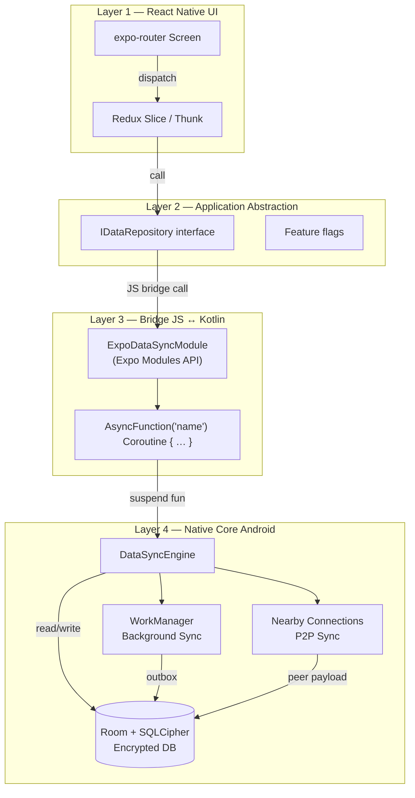
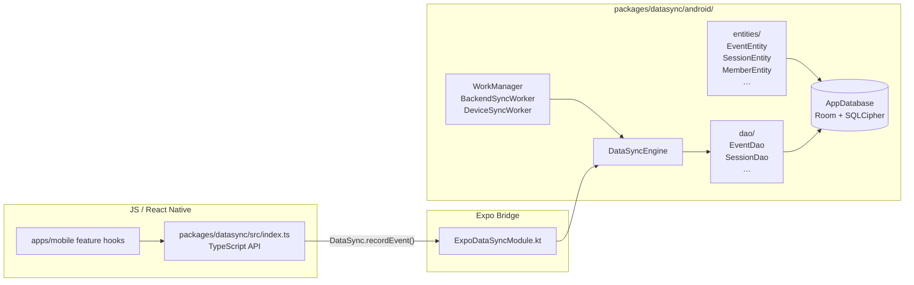
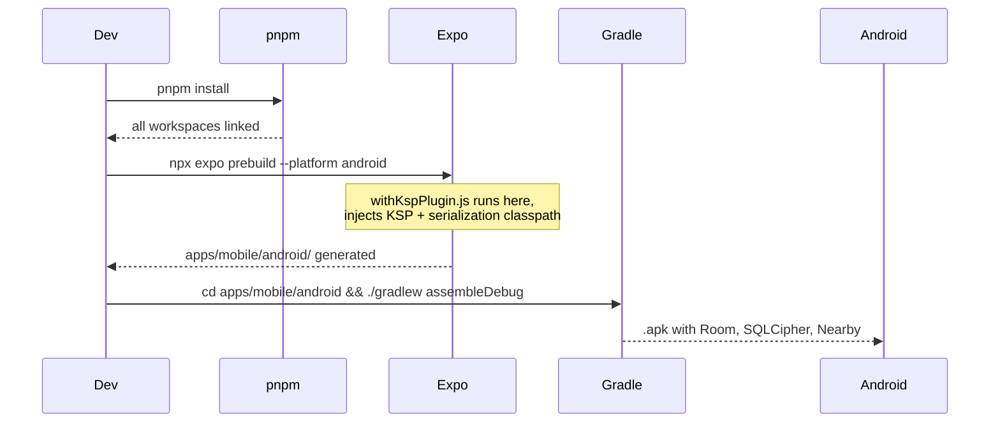
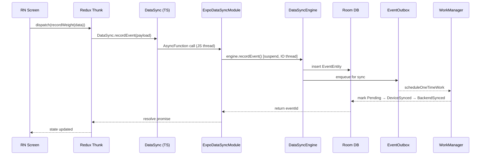

# pnpm Monorepo · Expo React Native + Android Room DB — Quick Start

> For new devs: understand the project layout, data flow, and how to plug in a new Android or JS package in minutes.

---

## 1. What This Is

**FitSync** — an offline-first Android tablet app built as a **pnpm + Turborepo monorepo**.

| Layer | Tech |
|---|---|
| JS / React Native | Expo · expo-router · Redux Toolkit · TypeScript |
| Bridge (JS ↔ Kotlin) | Expo Modules API (`AsyncFunction … Coroutine { }`) |
| Native Android | Room 2.7.1 · SQLCipher · WorkManager · Nearby |

---

## 2. Repo Structure (30-second scan)

```
ReactNativeExpoRoom/
├── apps/
│   └── mobile/          ← Expo app (screens, Redux, navigation)
│       ├── src/
│       │   ├── app/         expo-router routes
│       │   ├── features/    feature-first: auth/ session/ member/ …
│       │   ├── store/       Redux slices
│       │   └── components/  shared UI
│       └── plugins/
│           └── withKspPlugin.js   ← injects KSP classpath at prebuild
│
├── packages/
│   ├── datasync/        ← Expo Module (Kotlin Room core)
│   │   ├── android/     ← Room entities, DAOs, WorkManager, Nearby
│   │   └── src/         ← TS types + JS exports
│   ├── shared/          ← pure TS: domain types, event definitions
│   ├── nfc/             ← NFC reader Expo Module
│   ├── ble-scale/       ← BLE scale Expo Module
│   └── ui/              ← shared React Native components
│
├── pnpm-workspace.yaml  ← declares all packages as workspaces
└── turbo.json           ← Turborepo pipeline (build → test)
```

---

## 3. Architecture Diagram



---

## 4. Room DB — How It Is Wired



### Key files

| File | Purpose |
|---|---|
| `packages/datasync/android/src/.../ExpoDataSyncModule.kt` | Bridge: exposes suspend fns to JS |
| `packages/datasync/android/src/.../engine/DataSyncEngine.kt` | Core logic: writes events to Room |
| `packages/datasync/android/src/.../db/entities/` | Room `@Entity` data classes |
| `packages/datasync/android/src/.../db/dao/` | Room `@Dao` query interfaces |
| `packages/datasync/android/src/.../worker/` | WorkManager background sync workers |
| `packages/datasync/src/index.ts` | TypeScript wrapper (callable from RN) |
| `apps/mobile/plugins/withKspPlugin.js` | Config plugin — injects KSP at `expo prebuild` |

---

## 5. Build Flow



---

## 6. pnpm Workspace Setup (from scratch)

### Step 1 — Scaffold

```bash
mkdir my-app && cd my-app
pnpm init
```

### Step 2 — `pnpm-workspace.yaml`

```yaml
packages:
  - "apps/*"
  - "packages/*"
```

### Step 3 — `turbo.json`

```json
{
  "pipeline": {
    "build": { "dependsOn": ["^build"], "outputs": ["dist/**"] },
    "test":  { "dependsOn": ["build"] },
    "lint":  {}
  }
}
```

### Step 4 — Create the Expo app

```bash
mkdir -p apps/mobile
cd apps/mobile
npx create-expo-app . --template blank-typescript
```

### Step 5 — Create a shared TS package

```bash
mkdir -p packages/shared/src
# packages/shared/package.json
{
  "name": "@fitsync/shared",
  "main": "src/index.ts",
  "types": "src/index.ts"
}
```

### Step 6 — Create an Expo Module package (Android)

```bash
npx create-expo-module packages/datasync --local
```

This generates the Kotlin stubs. Add Room to its `build.gradle` (see §4 table above).

### Step 7 — Link workspace packages in the mobile app

```json
// apps/mobile/package.json
"dependencies": {
  "@fitsync/shared":   "workspace:*",
  "@fitsync/datasync": "workspace:*",
  "@fitsync/ui":       "workspace:*"
}
```

```bash
pnpm install   # symlinks packages automatically
```

---

## 7. Quick Package Scaffolding Commands

Use these one-liners to create different types of packages in your monorepo.

### A — Pure TypeScript Package (Utils, Types, Constants)

```bash
# Create folder and package.json
mkdir -p packages/my-utils/src
cd packages/my-utils

# Init with workspace scoping
pnpm init

# Add to package.json manually:
# {
#   "name": "@fitsync/my-utils",
#   "main": "src/index.ts",
#   "types": "src/index.ts"
# }

# Create tsconfig.json
cat > tsconfig.json << 'EOF'
{
  "extends": "../../packages/tsconfig/base.json",
  "compilerOptions": {
    "outDir": "./dist",
    "rootDir": "./src"
  },
  "include": ["src/**/*"]
}
EOF

touch src/index.ts
pnpm install @fitsync/my-utils --workspace
```

### B — Shared UI Components Package

```bash
mkdir -p packages/my-ui/src
cd packages/my-ui
pnpm init

# Add to package.json:
# {
#   "name": "@fitsync/my-ui",
#   "main": "src/index.ts",
#   "peerDependencies": {
#     "react": ">=19.0.0",
#     "react-native": ">=0.83.0"
#   }
# }

cp ../../packages/tsconfig/react-native.json ./tsconfig.json

# Create component
cat > src/Button.tsx << 'EOF'
import React from 'react';
import { Pressable, Text, StyleSheet } from 'react-native';

export const Button: React.FC<{ title: string; onPress: () => void }> = ({
  title,
  onPress,
}) => (
  <Pressable style={styles.button} onPress={onPress}>
    <Text style={styles.text}>{title}</Text>
  </Pressable>
);

const styles = StyleSheet.create({
  button: { padding: 12, backgroundColor: '#208AEF', borderRadius: 8 },
  text: { color: '#fff', fontSize: 16, fontWeight: '600' },
});
EOF

echo "export { Button } from './Button';" > src/index.ts
```

### C — Expo Module (Android + Kotlin + Room)

```bash
# Generate Expo module scaffold
npx create-expo-module packages/my-datasync --local

cd packages/my-datasync

# Update expo-module.config.json
cat > expo-module.config.json << 'EOF'
{
  "platforms": ["android"],
  "android": {
    "modules": ["com.example.MyDatasyncModule"]
  }
}
EOF

# Create the main Kotlin module
mkdir -p android/src/main/java/com/example
cat > android/src/main/java/com/example/MyDatasyncModule.kt << 'EOF'
package com.example

import expo.modules.kotlin.modules.Module
import expo.modules.kotlin.modules.ModuleDefinition
import expo.modules.kotlin.functions.Coroutine

class MyDatasyncModule : Module() {
  override fun definition() = ModuleDefinition {
    Name("MyDatasync")

    AsyncFunction("getData") Coroutine { ->
      // Suspend function — hits Kotlin coroutines
      emptyMap<String, Any>()
    }
  }
}
EOF

# Create TS wrapper
cat > src/index.ts << 'EOF'
import { requireNativeModule } from 'expo-modules-core';

const MyDatasyncNative = requireNativeModule('MyDatasync');

export const MyDatasync = {
  getData: () => MyDatasyncNative.getData(),
};
EOF

# Add Room to build.gradle
# (see apps/mobile/android/app/build.gradle for Room dependencies)
```

### D — Link New Package to Mobile App

```bash
# 1. Add dependency to apps/mobile/package.json
cd apps/mobile
pnpm add @fitsync/my-utils --workspace
pnpm add @fitsync/my-ui --workspace
pnpm add @fitsync/my-datasync --workspace

# 2. Reinstall monorepo
pnpm install

# 3. For Expo modules, regenerate Android
npx expo prebuild --platform android --clean
```

---

## 8. Expo Modules API — JS ↔ Kotlin Pattern

```kotlin
// ExpoDataSyncModule.kt
class ExpoDataSyncModule : Module() {
  override fun definition() = ModuleDefinition {
    Name("DataSync")

    // AsyncFunction + Coroutine = safe suspend bridge
    AsyncFunction("recordEvent") Coroutine { payload: String ->
      engine.recordEvent(Json.decodeFromString(payload))   // suspend call
    }

    // Send real-time event to JS
    Events("onSyncStatusChanged")
  }
}
```

```typescript
// packages/datasync/src/index.ts
import { requireNativeModule } from 'expo-modules-core';
const DataSyncNative = requireNativeModule('DataSync');

export const DataSync = {
  recordEvent: (payload: object) =>
    DataSyncNative.recordEvent(JSON.stringify(payload)),
};
```

```typescript
// apps/mobile – usage in a thunk
await DataSync.recordEvent({ type: 'WeightRecorded', ... });
```

---

## 9. Event Flow — End to End



---

## 10. Adding a New Package (checklist)

### A — Pure TypeScript package

```
packages/my-pkg/
  package.json    ("name": "@fitsync/my-pkg", "main": "src/index.ts")
  tsconfig.json   (extends ../../packages/tsconfig/base.json)
  src/index.ts
```

1. Add `"@fitsync/my-pkg": "workspace:*"` to `apps/mobile/package.json`
2. `pnpm install`
3. Import normally: `import { } from '@fitsync/my-pkg'`

### B — Android Expo Module package (with Room / Kotlin)

```
packages/my-module/
  expo-module.config.json   ← { "platforms": ["android"], "android": { "modules": ["com.example.MyModule"] } }
  package.json              ← name + version
  android/
    build.gradle            ← apply ksp, add Room deps
    src/main/java/com/example/
      MyModule.kt           ← class MyModule : Module() { … }
      db/                   ← entities, DAOs, database
  src/
    index.ts                ← TS wrapper
```

Key rules:
- All suspend calls in `AsyncFunction("x") Coroutine { … }` — **never** plain `AsyncFunction`
- Add KSP config plugin if using Room annotations (see `withKspPlugin.js`)
- Register module in `expo-module.config.json`
- After `pnpm install`, run `npx expo prebuild --platform android --clean` to regenerate

---

## 11. Quick Command Reference

```bash
pnpm install                                # install all workspaces
npx expo start                              # Metro dev server (press a for Android)
npx expo prebuild --platform android        # regenerate native Android project
npx expo run:android                        # build + install on device
cd apps/mobile/android && ./gradlew assembleDebug  # direct Gradle build

cd apps/mobile && npx jest                  # run 69 mobile tests
cd packages/shared && npx jest              # run 30 shared tests
npx jest --coverage                         # coverage report
```

---

## 12. Gotchas

| Problem | Fix |
|---|---|
| KSP not found after prebuild | `withKspPlugin.js` must be listed in `app.json` plugins |
| Room compile error after adding entity | Add entity to `@Database(entities = […])` and bump `version` |
| `AsyncFunction` hangs on suspend call | Wrap body with `Coroutine { }` infix — required for all suspend calls |
| Package not found in metro | Run `pnpm install` then restart Metro with `--reset-cache` |
| ABI mismatch on non-Samsung device | Remove `abiFilters "arm64-v8a"` in `withKspPlugin.js` for local testing |
